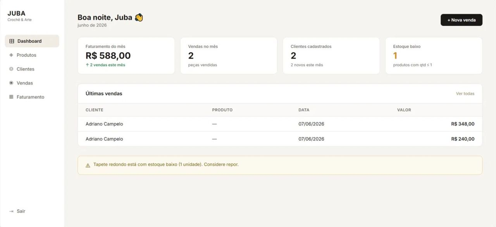
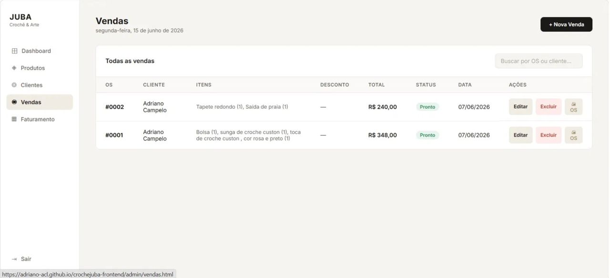
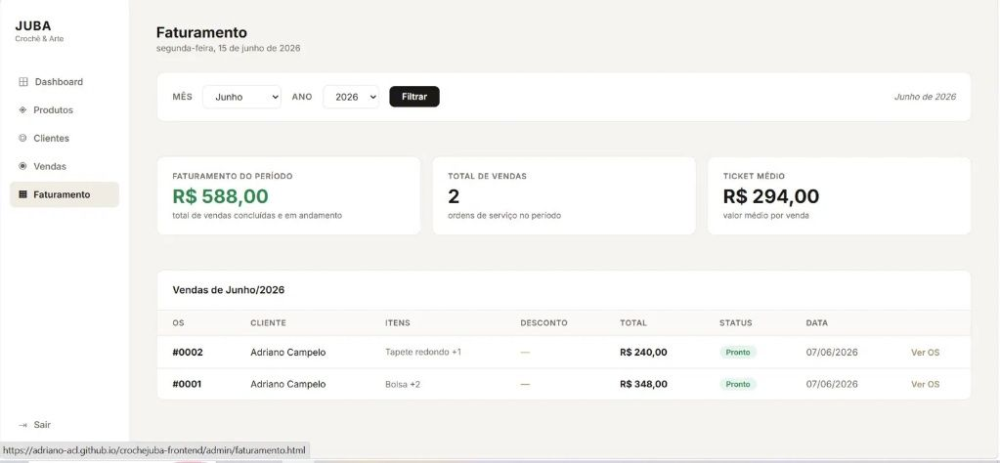
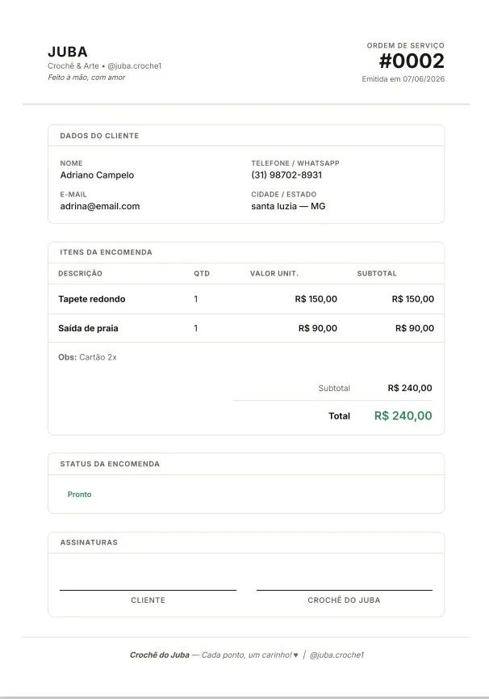

# Projeto Juba - Sistema de Gestão para Ateliê de Crochê

## 📝 Descrição do Projeto
Esta é a interface do sistema desenvolvido para o ateliê "Juba Crochê & Arte". O objetivo do projeto é centralizar e simplificar a gestão de pedidos, clientes, estoque e faturamento, substituindo controles manuais por uma solução digital integrada.

O sistema permite o acompanhamento completo de cada encomenda, desde a atração do cliente na página inicial até o controle financeiro e a geração da Ordem de Serviço (O.S.) final.

## 🚀 Funcionalidades Principais da Interface
*   **Página Inicial (Landing Page):** Apresentação da marca e catálogo para o cliente final.
*   **Dashboard Administrativo:** Painel geral com indicadores de faturamento, vendas e alertas de estoque baixo.
*   **Gestão de Vendas:** Listagem centralizada de pedidos com status e histórico.
*   **Controle de Faturamento:** Relatórios e gráficos de faturamento mensal e ticket médio.
*   **Emissão de O.S.:** Geração de Ordens de Serviço completas para impressão ou envio.

## 💻 Demonstração Visual (Screenshots)

---

### 1. Página Inicial / Landing Page
Porta de entrada do sistema focado na experiência do usuário e conversão.

---

### 2. Dashboard Administrativo
Visão geral do negócio com os principais indicadores em tempo real.

---

### 3. Gerenciamento de Vendas e Pedidos
Painel para controle e alteração de status das ordens de serviço.

---

### 4. Relatório de Faturamento
Área de Business Intelligence para análise de desempenho financeiro.

---

### 5. Ordem de Serviço (O.S.) Final
Exemplo de documento profissional gerado pelo sistema para o cliente.

---

## 🛠️ Tecnologias Utilizadas no Front-end
*   HTML5
*   CSS3
*   JavaScript (Consumo de API / Banco de Dados Relacional MySQL)
